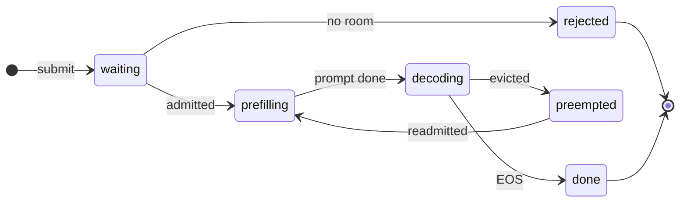
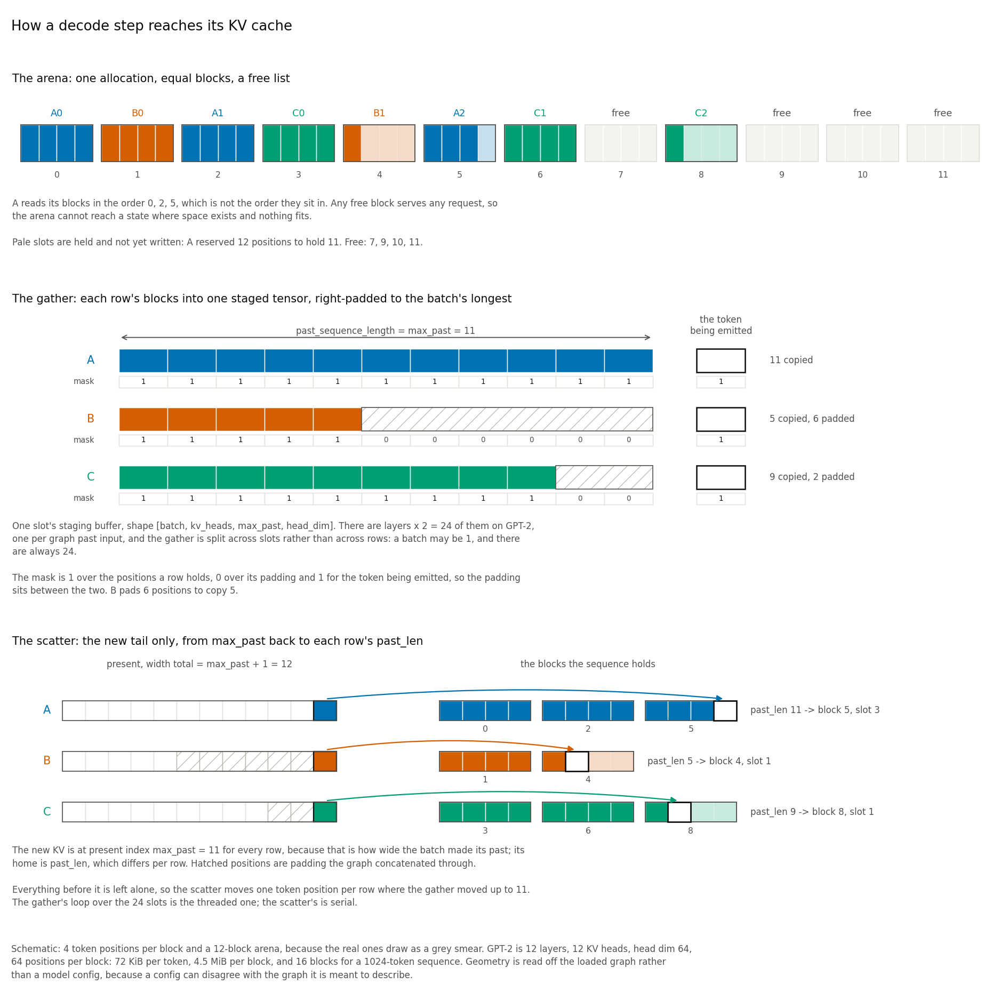
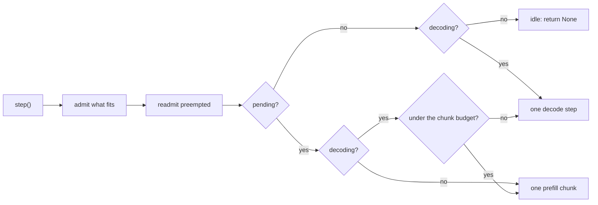

# Architecture

One process, two halves with a narrow interface between them: a Python control
plane that decides, and a C++ engine that computes. Stage 1 ran the engine as a
pool of subprocesses speaking JSON; it is now an extension module loaded into the
same interpreter.

```text
                +-----------------------------------+
  requests ---> | AdaptiveServer                    |
                |                                   |
                |   LoadMonitor      CPU load EWMA  |
                |   AdaptiveSelector variant choice |
                |   MMcAdmission     sojourn bound  |
                |   in-flight count  backlog        |
                +----------------+------------------+
                                 |  ThreadPoolExecutor
                                 v
                +-----------------------------------+
                | RuntimePool                       |
                |   N RuntimeClients, one per worker|
                +----------------+------------------+
                                 |  in-process call, borrowed tensors
                                 v
                +-----------------------------------+
                | anytime_runtime (C++ extension)   |
                |   one ONNX Runtime session per    |
                |   variant, 1 intra-op thread,     |
                |   GIL released during inference   |
                +-----------------------------------+
```

## Request lifecycle

1. `AdaptiveServer.submit` timestamps the arrival and records it in a
   one-second sliding window to estimate the arrival rate.
2. It reads the smoothed CPU load and the current in-flight count.
3. `AdaptiveSelector.select` walks variants from most to least accurate and
   returns the first whose estimated sojourn time fits the deadline. If none
   fits, it returns the fastest variant and the request is rejected.
4. Admitted requests are dispatched to a free `RuntimeClient`. The in-flight
   count is incremented before queueing and released on every exit path.
5. The result is recorded as a `ServedRequest`: chosen variant, measured
   runtime and wall latency, predicted sojourn, load, and compute cost.

## The decoder path

Encoders run once per request; decoders run once per token, and the two need
different shapes of machinery. The decoder path is a second lane through the same
extension, following the same split:

```text
                +-----------------------------------+
  generations   | ContinuousBatchScheduler          |
      --------> |   one prefill chunk, or one       |
                |   batched decode step, per turn   |
                +----------------+------------------+
                                 |  what fits, and who to evict for it
                                 v
                +-----------------------------------+
                | BlockAdmission                    |
                |   blocks needed vs blocks free    |
                |   eviction ordered by deadline    |
                |   slack, priced against recompute |
                +----------------+------------------+
                                 |  a plan: admit, and who to preempt
                                 v
                +-----------------------------------+
                | DecoderClient                     |
                |   token history per sequence      |
                |   greedy stepping, TTFT and TPOT  |
                +----------------+------------------+
                                 |  prefill / decode / release
                                 v
                +-----------------------------------+
                | anytime_runtime.DecoderSession    |
                |   fixed block arena               |
                |   gather -> Run -> scatter tail   |
                +-----------------------------------+
```

The division of labour is the same one as above, applied to memory rather than to
time. `DecoderSession` owns the arena and knows nothing about deadlines;
`BlockAdmission` reasons about deadlines and imports no runtime. `DecoderClient`
holds the one thing neither does: the tokens a sequence has produced, which is what
lets the arena give its blocks away and still finish the sequence correctly later.

Two consequences worth stating:

- **A decoding sequence is not a request.** It occupies its blocks for hundreds of
  steps, so "admit and see" does not work the way it does for an encoder. Either the
  arena can hold it or somebody has to be preempted for it.
- **Preemption is preempt-and-recompute, and it costs.** Resuming re-runs the whole
  history, so eviction is only safe for a sequence with enough deadline slack to
  absorb that. Output is token-identical either way, which is what makes it a
  scheduling decision rather than a correctness bug.

The decoder path is still not wired into `AdaptiveServer`: a decode request holds a
worker for hundreds of steps, and reconciling that with the encoder harness is separate
work.

### What a sequence goes through

The two stacks above are drawn as text because a layered stack is what text draws well,
and they stay readable in an editor that renders no diagrams. The two things below are
graphs with cycles in them, which text draws badly, so they are Mermaid -- which GitHub
renders natively and which stays diffable. A reader without a renderer sees the labels in
source order, which is degraded but not useless.



Blocks are reserved for the whole generation on admission and released on eviction or on
completion, so a rejection means no blocks were free and nobody had the deadline slack to
be evicted for the arrival. `prefilling` advances one chunk per turn and `decoding` emits
one token per batched step; neither self-transition is drawn, because a self-loop's label
lands on top of its neighbour's in every layout Mermaid gives this graph.

The arc worth following is `decoding -> preempted -> prefilling`. A preempted sequence
does not resume: it goes back to the pending queue and re-runs its entire history, which
is why eviction is priced against deadline slack rather than taken whenever the arena is
tight. The tokens are what survive the round trip, and they are why the output is
identical either way.

### Where a token's KV actually lives

The third thing this page has to draw is neither a stack nor a graph. It is spatial: a
sequence's blocks are scattered through the arena while the tokens they hold have to
arrive at the graph contiguous, and the gap between those two facts is what the gather
does and what it costs. Mermaid lays out graphs, and ASCII can hold a grid but not
proportions, so this one is a rendered figure, committed like the measured ones and
regenerated by `python scripts/draw_arena_geometry.py`. It plots no measurement; the
numbers in it are a schematic's, and only the caption's are GPT-2's.



Three things in it are worth saying in prose as well, because they are the ones that
decide what the runtime costs.

**The padding is a hole, and it is timed apart from the copy.** Rows are right-padded to
the batch's longest past, so a batch of equal lengths pads nothing and one long sequence
beside several short ones pads almost as many token positions as it copies. `gather_ms`
and `pad_ms` are separate numbers for that reason: the copy scales with the real tokens
in the batch, the clear with its length spread, and a step that got slower can say which
of the two it was paying for. `pad_ms` is an exact zero when no row is short, decided
once rather than discovered by walking every row.

**`position_ids` carries the true absolute position**, so a padded row's new token is
placed where its sequence says rather than where the batch's width would put it. The
attention mask is what tells the graph the padding is not history: 1 over the positions
a row holds, 0 over the padding, and 1 for the token being emitted.

**The scatter is cheap because of an invariant that is checked rather than assumed.**
`present[..., :past_len, :]` comes back bitwise equal to the `past` that was fed, because
the graph concatenates rather than rewriting, and that is what lets the scatter copy one
token position per row instead of the whole tensor. It is verified once per sequence, and
a mismatch raises instead of falling back to a full-present scatter -- a silent fallback
would change what TPOT measures without saying so.

### The scheduler alternates, because the graph will not let it fuse

The graph takes one `sequence` dimension as well as one `past_sequence_length`. So a
mixed prefill/decode batch is not merely wasteful, it is unrepresentable: a 256-token
prefill chunk and a one-token decode step cannot share a `Run` without padding the
decode row out to 256. vLLM and SARATHI fuse the two with a flattened varlen layout and
custom kernels; a stock exported graph has neither.

`ContinuousBatchScheduler` therefore **alternates**. Each iteration is one prefill
chunk or one batched decode step, never both. That is a consequence of the graph rather
than a preference, and it makes chunk width the central tuning knob: while a chunk
runs, every resident sequence waits.

One iteration, as the code decides it. Admission runs first and every time, in arrival
order, carrying out any eviction plan; readmission follows, oldest first, putting a
preempted sequence back on the pending queue rather than back into the batch. Neither is
an iteration of its own, because neither invokes the graph. "The chunk budget" is
`prefill_chunks_per_decode` chunks since the last decode step.



With nothing decoding, prefill runs unconditionally -- there is no one to starve. With
both available the two alternate, and at the default of one chunk per decode a resident
sequence waits at most one chunk plus one step, which is the guarantee chunk width is
chosen against.

The trade is measurable and measured. At the 256-token default, over six generations
sharing one arena, a sequence that was already decoding went a median 27 ms and at most
192 ms between tokens, against a 76 ms prefill chunk and a 23 ms decode step. Raising
`prefill_chunks_per_decode` from 1 to 4 -- which reaches first tokens sooner because
prefill runs further ahead -- moved those to 40 ms and 244 ms. Both figures are `fp32`;
at `int4`, where a chunk is 428 ms, the worst gap is 790 ms at 1 chunk and 1145 ms at 4.

Two things that gap is *not*. It is not purely the chunk: with more sequences resident
than the batch is wide, a sequence can also miss a turn to round-robin, and the recorded
number is the honest "longest a decoding sequence went without a token" rather than an
attribution. And it is not a lower bound on jitter for a well-sized deployment -- it is
what one particular schedule did, and the arena in that trace held every sequence, so
nothing was waiting on memory.

### Who shares a decode step

Round-robin over the decoding queue by default: the batch is the front of it, and the
sequences served move to the back. That gives every sequence the same service rate,
which is why the four prompt lengths of the spread workload finish within 1.8 ms a token
of each other at every load measured.

`length_bucketing` trades that uniformity for throughput. It **anchors** the batch on the
head of the queue -- the sequence that has waited longest -- and fills the remaining
slots by nearest cached length, so a step runs over rows of similar length and wastes
less on right-padding. Anchoring rather than sorting by length is what makes starvation
impossible: the anchor is always at the front and always moves to the back, so an
unserved sequence's position strictly decreases and it becomes the anchor within N steps.
The bound falls out of the rule, so there is no age guard to tune. Deleting the anchor
and taking a pure length sort is a test that must fail, and does.

It is off by default and it earns its place only past saturation. `docs/benchmarks.md`
has what it bought (throughput, in 12 of 12 paired comparisons) and what it spent (a
service rate that now depends on where a sequence sits in the length distribution).

## Why the split

The control plane needs to be cheap and observable; inference needs to be fast.
Keeping them separate, even inside one process, means:

- Each worker holds its own single-threaded ONNX Runtime sessions, so N workers
  behave as N independent servers and the queueing model is a clean M/M/c.
- The control plane has no torch or pandas dependency and runs anywhere.
  `tests/test_import_boundaries.py` enforces this.
- The engine can be replaced or bypassed. `RuntimeClient` also has a backend that
  runs ONNX Runtime through its Python wheel, which is what the extension is
  tested against.

### What moving in-process cost

The subprocess boundary bought fault isolation, and that is now gone: a crash
inside ONNX Runtime takes the whole server down rather than one worker. Stage 1's
worker caught per-request exceptions and kept serving; the engine still reports
recoverable errors as exceptions, but a genuine segfault is no longer contained.
That is a real regression, accepted deliberately.

What it bought is the thing the rest of Stage 2 needs. A process boundary makes
batching across requests and sharing a KV cache between them impossible, because
the tensors live in the wrong address space. Transport also fell from 0.296 ms to
0.018 ms per request, but against 14 ms of inference that was never the argument.

See [`runtime.md`](runtime.md) for the measured comparison.

## Worker count is a first-class parameter

The number of workers determines queue capacity, so it appears explicitly in the
admission maths rather than being inferred. `AdaptiveSelector` takes `servers`
and constructs its own controller; `AdaptiveServer` raises if that value does not
equal `RuntimePool.size`:

```python
selector = AdaptiveSelector(variants, servers=4)
server = AdaptiveServer(pool, selector, monitor)  # raises if pool.size != 4
```

This is deliberate. An earlier version passed a per-worker service rate into a
single-server queueing formula, which understated capacity by the worker count
and shed traffic the pool could serve comfortably. Making the mismatch
unrepresentable is cheaper than detecting it.

### Batching the encoder does not move it toward the decoder's model

The encoder lane is N workers each blocking on one request; the decoder lane is one
scheduler multiplexing M sequences over a batched `Run`. `serving/batching.py` adds
batching to the encoder, and the expectation was that this would move the two models
closer together and dissolve part of what makes merging them hard. **It does not, and
the reason is worth recording: the encoder's batch width is bounded by exactly the
quantity that makes M/M/c valid.**

A batch of K needs K requests at the runtime simultaneously. Two things cap that, and
neither lives in the runtime:

- **`AdaptiveServer`'s `max_in_flight`**, which defaults to `RuntimePool.size`. Four
  workers means at most four requests are ever inside `pool.infer`, so the widest batch
  is four.
- **Admission itself**, which is the bound that cannot be configured away.
  `AdaptiveSelector._sojourn_estimate_ms` charges an arrival
  `ceil(queue_depth / servers) + 1` service times, so it rejects once the backlog would
  outlast the deadline. `AdaptiveSelector.max_admissible_queue_depth` computes it, and
  it comes out to `servers * floor(deadline_ms / service_time_ms - 1)`: **8 for
  DistilBERT at 12.893 ms and 24 for MiniLM at 5.189 ms** against the 38.7 ms deadline,
  so the widest admissible batches are 9 and 25.

So widening the encoder's batch is an admission-model decision, not a runtime one --
which is the same decision the decoder merge needs, arrived at from the other side.
Batching does not remove that choice; it localises it to one number. `docs/benchmarks.md`
has what the width is worth once you have it, and it is not much.

## Multiple inputs per variant

Variants of the same task can declare different graph inputs: DistilBERT takes
`input_ids` and `attention_mask`, BERT-family models additionally take
`token_type_ids`. The variant is chosen after the request is built, so callers
send the union and the runtime keeps the subset its graph declares. The C++
engine and the Python reference backend implement identical filtering, and a
request missing a declared input is an error rather than a silent wrong answer.

## What "Stage 1" and "Stage 2" refer to

These pages date findings against two rewrites, and the labels are used often enough
to be worth defining once.

**Stage 1** made the existing design correct. It replaced the single-server
queueing model with M/M/c, which had been understating pool capacity by the worker
count and shedding traffic the pool could serve; replaced numbers that had been
written down with numbers measured on this host; added CI; and deleted scaffolding
that fed nothing. Inference ran in a pool of C++ subprocesses speaking
line-delimited JSON.

**Stage 2** is the current one. It moved inference in-process as a pybind11
extension, validated against the subprocess worker before deleting it, then added a
decoder path: GPT-2 exported with its KV cache in the graph signature at three
precisions, a block-allocated arena for that cache, admission and eviction against the
arena's occupancy, and a continuous batching scheduler over all of it.

Unrelated sense, same word: `models/cascade.py` and the `experiments/` pipeline call
the two models of a cascade "stage 1" and "stage 2" — the cheap model, then the
accurate one if its confidence is too low. Nothing to do with the above.

## Where this sits

Four pieces of published work this design is measured against or deliberately
departs from. Each is here because something in the repository either implements it,
declines it, or stands in for it.

- **[Orca](https://www.usenix.org/conference/osdi22/presentation/yu)** (Yu et al.,
  OSDI '22) introduced iteration-level scheduling: admit and retire sequences
  between decode steps rather than between whole batches. `ContinuousBatchScheduler`
  is that, over the arena and admission policy built for it. What it does not take
  from Orca is the selective batching of a fused prefill/decode iteration, for the
  graph reason above.
- **[PagedAttention](https://arxiv.org/abs/2309.06180)** (Kwon et al., SOSP '23)
  pages KV across non-contiguous blocks by handing attention a block table. This
  repository does not do that and, over a stock exported graph, cannot — the
  argument is in [`runtime.md`](runtime.md). The block arena here takes the
  accounting and not the kernel, and the docs are careful never to call it paged
  attention.
- **[SARATHI](https://arxiv.org/abs/2308.16369)** (Agrawal et al., 2023) splits a
  prefill into chunks and piggybacks decode steps onto them. The chunked prefill
  here is the first half of that. The piggybacking is not reachable: the graph takes
  one sequence length for the whole batch, so a one-token decode row sharing a run
  with a 256-token prefill chunk would have to be padded to the chunk width.
- **[INFaaS](https://www.usenix.org/conference/atc21/presentation/romero)** (Romero
  et al., ATC '21) picks a model variant per request against a latency target.
  `planner/infaas_style_baseline.py` is an offline stand-in for that policy, used as
  a comparison rather than as a reimplementation.

## Further reading

- [`planner.md`](planner.md) — admission control and variant selection
- [`runtime.md`](runtime.md) — the C++ engine, version matching, and the measured transport cost
- [`benchmarks.md`](benchmarks.md) — measurement methodology and results
